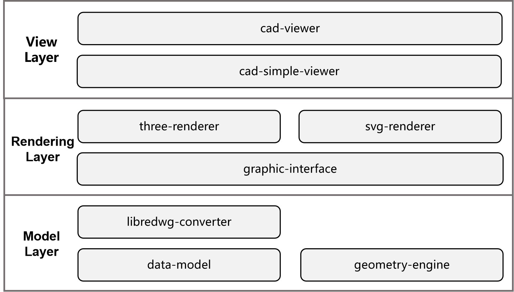

# CAD-Viewer

[**🌐 Live Demo**](https://mlight-lee.github.io/cad-viewer/)

[**🌐 API Docs**](https://mlight-lee.github.io/cad-viewer/docs/)

CAD-Viewer is a **high-performance**, modern, web-based CAD editor inspired by AutoCAD. It enables users to view and edit DWG/DXF files **entirely in the browser without requiring any backend server**, providing exceptional rendering speed and smooth interactions. The project is modular and designed for seamless integration with other applications.

## Features

- **High-performance** viewing of large DWG/DXF files with smooth 60+ FPS rendering
- **No backend required** - Files are parsed and processed entirely in the browser
- **Enhanced data security** - Files never leave your device, ensuring complete privacy
- **Easy integration** - No server setup or backend infrastructure needed
- Modular architecture for seamless third-party integration
- Offline and online editing workflows
- THREE.js 3D rendering engines with advanced optimization techniques
- Designed for extensibility and integration with platforms like CMS, Notion, and WeChat

## How to Use

### Desktop Browser Operations
- **Select**: Left-click on entities
- **Zoom in/out**: Scroll mouse wheel up/down
- **Pan**: Hold middle mouse button and drag

### Pad/Mobile Browser Operations
- **Select**: Tap on entities
- **Zoom**: Pinch with two fingers to zoom in/out
- **Pan**: Drag with two fingers to move the view

## Performance

CAD-Viewer is engineered for **exceptional performance** and can handle very large DXF/DWG files while maintaining high frame rates. It employs multiple advanced rendering technologies to optimize performance:

- **Custom Shader Materials**: Uses GPU-accelerated shader materials to render complex line types and hatch fill patterns efficiently
- **Geometry Batching**: Merges points, lines, and areas with the same material to dramatically reduce draw calls
- **Instanced Rendering**: Optimizes rendering of repeated geometries through instancing techniques
- **Buffer Geometry Optimization**: Efficient memory management and geometry merging for reduced GPU overhead
- **Material Caching**: Reuses materials across similar entities to minimize state changes
- **WebGL Optimization**: Leverages modern WebGL features for hardware-accelerated rendering

These optimizations enable CAD-Viewer to smoothly render complex CAD drawings with thousands of entities while maintaining responsive user interactions.

## Known Issues

CAD-Viewer has some known limitations that users should be aware of:

- **Unsupported Entities**: 
  - **Tables** (DWG files only): Table entities are not currently supported in DWG files because [LibreDWG](https://github.com/LibreDWG/libredwg) is used to read DWG files and it doesn't support table entity yet. If one table is created by line and polyline entities, definitely it is supported.
  - **XRefs**: External references (XRefs) are not supported and will not be displayed.
- **DWG File Compatibility**: Some DWG drawings may fail to open due to bugs in the underlying [LibreDWG](https://github.com/LibreDWG/libredwg) library. This is a known limitation of the current DWG parsing implementation. If you find those issues, please log one issue on [CAD-Viewer issues page](https://github.com/mlight-lee/cad-viewer/issues) or [LibreDWG issues page](https://github.com/LibreDWG/libredwg/issues).

These issues are being tracked and will be addressed in future releases.

## Roadmap

To achieve the final goal, the following milestones are defined:

- [x] **DWG/DXF Viewer**: Create an offline web viewer for DWG/DXF files.
- [x] **Entity Editing Framework**: Support drawing modification.
- [ ] **Integration**: Integrate the DWG/DXF viewer into other applications or frameworks (e.g., CMS, Notion, OpenLayers).
- [ ] **WeChat App**: Develop a WeChat app to display DWG/DXF files within WeChat.
- [ ] **Offline CAD Editor**: Build an offline CAD editor that allows users to modify DWG/DXF files in the browser and store changes locally.
- [ ] **Online CAD Editor**: Add backend support to enable users to store changes to DXF/DWG files in the cloud.

**Note**: 

The second item is partially finished now. While CAD-Viewer doesn't support saving modificaiton to DWG/DXF files now, it provides comprehensive support for modifying drawings in real-time. You can add, edit, and delete entities within the drawing by [RealDWG-Web API](https://mlight-lee.github.io/realdwg-web/), and the viewer will automatically update to reflect these changes. The usage patterns of [RealDWG-Web API](https://mlight-lee.github.io/realdwg-web/) are very similar to AutoCAD RealDWG. If you're familiar with AutoCAD RealDWG development, you'll find the API structure and workflow nearly identical. Please refer to [cad-simple-viewer README](packages/cad-simple-viewer/README.md) to get more details.

## Browser-Only Architecture

CAD-Viewer operates entirely in the browser with **no backend dependencies**. DWG/DXF files are parsed and processed locally using WebAssembly and JavaScript, ensuring:

- **Zero server requirements** - Deploy anywhere with just static file hosting
- **Complete data privacy** - Files never leave the user's device
- **Instant integration** - No complex backend setup or API configuration
- **Offline capability** - Works without internet connectivity

CAD-Viewer is organized into several subpackages, each responsible for a specific aspect of the system:

- **cad-viewer**: Main Vue 3 component and frontend application, including UI components, dialogs, toolbars, state management, and integration with rendering engines.
- **cad-simple-viewer**: Core logic for document management, command handling, and integration between UI and rendering engines. Framework-agnostic and UI-free (canvas only).
- **svg-renderer**: Renders DWG/DXF entities as SVG graphics for exporting and scalable 2D output.
- **three-renderer**: Uses THREE.js to render DWG/DXF entities as interactive 2D/3D graphics with advanced visualization and custom shaders.

## Architecture Overview

**CAD-Viewer** is a high-performance, browser-only DWG/DXF viewer that adopts a modular and extensible architecture to support loading, parsing, rendering, and interacting with multiple CAD data formats. The system is divided into the following core layers:

This layered architecture ensures that **CAD-Viewer** can maintain high performance, low latency, and strong scalability when dealing with different data scales, rendering requirements, and deployment environments.

### **Model Layer**

- Defines a unified **Data Model** for describing parsed CAD data (including geometric entities, layer information, view parameters, etc.) through the [`@mlightcad/data-model`](https://github.com/mlight-lee/realdwg-web) module in [`realdwg-web`](https://github.com/mlight-lee/realdwg-web).
- Implements a unified CAD file conversion interface via [`AcDbDatabaseConverter`](https://github.com/mlight-lee/realdwg-web/blob/main/packages/data-model/src/database/AcDbDatabaseConverter.ts), enabling different converters to transform CAD data into the unified Data Model.
- Provides DWG parsing capabilities through the [`@mlightcad/libredwg-converter`](https://github.com/mlight-lee/realdwg-web) module in `realdwg-web`, converting DWG files into the unified Data Model.
- Provides DXF parsing capabilities via the [`@mlightcad/dxf-json`](https://github.com/mlight-lee/dxf-json) module, converting DXF files into the unified Data Model.
- Offers a geometry engine through the [`@mlightcad/geometry-engine`](https://github.com/mlight-lee/realdwg-web) module in `realdwg-web`, supporting various geometric computations (points, lines, polylines, splines, circles, arcs, ellipses, elliptical arcs) as well as mathematical operations (vectors, matrices, etc.).

A quick note on why we define the `AcDbDatabaseConverter` interface: existing DXF/DWG read/write and conversion tools on the market are often incomplete. I’ve implemented `@mlightcad/libredwg-converter` and `@mlightcad/dxf-json` based on some open-source code. However, the best DWG/DXF parsing and conversion tool available is actually [ODA](https://www.opendesign.com/products/drawings). To use it, you must purchase a license to access its source code, from which you can build a WebAssembly module that converts DXF/DWG into the unified Data Model defined in `@mlightcad/data-model`. If someone happens to share ODA’s source code with me, I could also implement a converter based on it.

### **Rendering Layer**

- Defines a unified rendering interface via the [`@mlightcad/graphic-interface`](https://github.com/mlight-lee/realdwg-web) module in `realdwg-web` for rendering various types of CAD entities.
- Implements the rendering interface in the [`@mlightcad/three-renderer`](https://github.com/mlight-lee/cad-viewer) module in `cad-viewer`, using Three.js to render all entity types.
- Implements the rendering interface in the [`@mlightcad/svg-renderer`](https://github.com/mlight-lee/cad-viewer) module in `cad-viewer`, rendering drawings as SVG.

### **View Layer**

- The [`@mlightcad/cad-simple-viewer`](https://github.com/mlight-lee/cad-viewer) module in `cad-viewer` provides the core viewing logic for CAD files, such as document management, command handling, and coordination between the UI and rendering engine. It has no UI framework dependency and offers no UI elements apart from the canvas.
- The [`@mlightcad/cad-viewer`](https://github.com/mlight-lee/cad-viewer) module builds on `@mlightcad/cad-simple-viewer` to provide a Vue 3-based UI with menus, toolbars, command line, status bar, and both dark and light themes. It packages all core features into a Vue 3 component for easy integration.

## Rendering Engine

Rendering DXF/DWG files poses several challenges:

- High-performance rendering of drawings containing a large number of entities.
- Reproducing AutoCAD’s text rendering effects.
- Supporting line styles and hatch patterns.

### High-Performance Rendering

For high-performance rendering of large drawings, the key is to merge points, lines, and faces to reduce **Draw Calls**. THREE.js offers a partial solution through the [BatchedMesh](https://threejs.org/docs/index.html?q=Mesh#api/en/objects/BatchedMesh) class for merging triangle meshes. However, it doesn’t support merging points and lines, and even its face merging doesn’t fully meet our needs. Therefore, we implemented several classes inspired by `BatchedMesh` to merge points, lines, and faces. You can check the [code here](https://github.com/mlight-lee/cad-viewer/tree/main/packages/three-renderer/src/batch).

I also wrote one article to introduce how batched geometry works.
- [Building a High-Performance Web-Based CAD Viewer with Batched Geometry System](https://medium.com/@mlight.lee/building-a-high-performance-web-based-cad-viewer-with-batched-geometry-system-a8859bbb0a3a)

### Text Rendering

AutoCAD uses the [`MText`](https://ezdxf.mozman.at/docs/dxfinternals/entities/mtext.html) format for rich text and a special [SHX](https://help.autodesk.com/view/OARX/2023/ENU/?guid=GUID-DE941DB5-7044-433C-AA68-2A9AE98A5713) font (a stroke-based font drawn only with lines) for faster rendering. The main challenges are:

- **Parsing MText** – Implemented with the [`@mlightcad/mtext-parser`](https://github.com/mlight-lee/mtext-parser) package.
- **Parsing SHX fonts** – Implemented with the [`@mlightcad/shx-parser`](https://github.com/mlight-lee/shx-parser) package.
- **Rendering MText** – Implemented with the [`@mlightcad/mtext-renderer`](https://github.com/mlight-lee/mtext-renderer) package. For performance, parsed font files are cached in the browser’s IndexedDB so that once downloaded and parsed, subsequent rendering is faster.

To debug text rendering, we built a THREE.js-based rich text editor, [mtext-editor](https://github.com/mlight-lee/mtext-editor). Currently, there’s no other open-source THREE.js-based rich text editor, so this can be reused as a text editor for any rendering engine.

### Line Styles and Hatch Patterns

AutoCAD supports custom line types and hatch patterns. We’ve implemented some of them (line types containing text are not yet supported). All line styles and hatch effects are implemented with THREE.js’s `ShaderMaterial`. You can check the [code here](https://github.com/mlight-lee/cad-viewer/tree/main/packages/three-renderer/src/style).

## Which Viewer Should I Use?

Choosing between `cad-viewer` and `cad-simple-viewer` depends on your project requirements and desired level of integration:

### Use **cad-viewer** if:
- You want a **ready-to-use Vue 3 component** with a modern UI, dialogs, toolbars, and state management.
- You need to quickly embed a high-performance CAD viewer/editor into your Vue application with minimal setup.
- You prefer a solution that handles file loading, rendering, layer/entity management, and user interactions out of the box.
- You want seamless integration with optimized SVG and THREE.js renderers, internationalization, and theming.
- You do **not** want to build your own UI from scratch.

**Recommended for:** Most web applications, dashboards, or platforms that need to display CAD files with a polished user interface.

### Use **cad-simple-viewer** if:
- You need **core CAD logic only** (document management, command stack, rendering engine integration) without any UI framework dependencies.
- You want to build your **own custom UI** or integrate CAD functionality into a non-Vue or non-web environment.
- You require maximum flexibility and performance for handling large CAD files, and plan to connect the logic to your own rendering or UI layer.
- You want a framework-agnostic solution that provides only the essential CAD operations and canvas rendering.

**Recommended for:** Custom integrations, headless CAD processing, or advanced users building highly tailored CAD solutions.

**Summary Table:**

| Package             | UI Provided | Framework | Use Case                                      |
|---------------------|-------------|-----------|-----------------------------------------------|
| `cad-viewer`        | Yes         | Vue 3     | Turnkey CAD viewer/editor with modern UI       |
| `cad-simple-viewer` | No          | None      | Core CAD logic for custom or headless use      |

For more details, see the [cad-viewer README](packages/cad-viewer/README.md) and [cad-simple-viewer README](packages/cad-simple-viewer/README.md).

## Examples

- [`cad-simple-viewer-example`](https://github.com/mlight-lee/cad-simple-viewer-example): Example application demonstrating how to use the `cad-simple-viewer` component in a real project.
- [`cad-viewer-example`](https://github.com/mlight-lee/cad-viewer-example): Example application demonstrating how to use the `cad-viewer` component in a real project.

## Contributing

Contributions are welcome! Please open issues or pull requests for bug fixes, new features, or suggestions. For bug reports, providing a link to the problematic drawing will help in reproducing and fixing the issue.

## License

[MIT](LICENSE)

