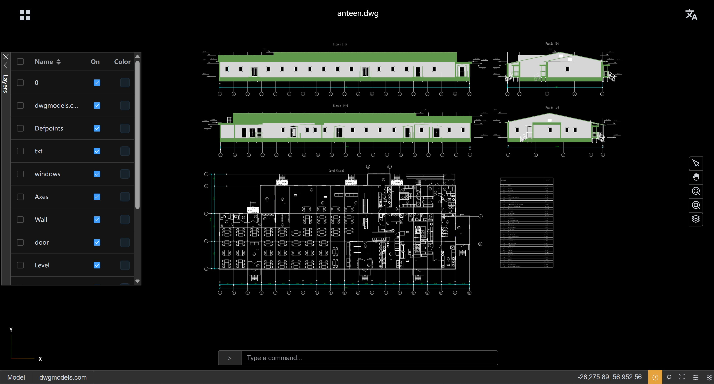

# CAD-Viewer（中文）

[English](./README.md)

CAD-Viewer 是一款高性能、现代化的 Web 端 CAD 查看与编辑器，灵感来自 AutoCAD。它支持在纯浏览器环境中查看与编辑 DWG/DXF 文件，**无需任何后端服务**，并具备出色的渲染速度与流畅交互。项目采用模块化设计，便于与其他应用无缝集成。

- [**🌐 在线演示**](https://mlightcad.gitlab.io/cad-viewer/)
- [**🌐 API 文档**](https://mlightcad.gitlab.io/cad-viewer/docs/)
- [**🌐 项目 Wiki**](https://gitlab.com/mlightcad/cad-viewer/-/wikis/home)

## 功能特性

- **高性能**：大体量 DWG/DXF 文件也能以流畅的 60+ FPS 渲染
- **无需后端**：文件在浏览器本地解析与处理
- **数据更安全**：文件不离开本地设备，保护隐私
- **易于集成**：无需服务器或后端基础设施
- 模块化架构，便于第三方系统集成
- 支持离线与在线编辑流程
- 基于 THREE.js 的 3D 渲染引擎，包含多项性能优化
- 面向可扩展与二次开发，适配 CMS、Notion、微信等平台

## 使用说明

### 桌面浏览器操作
- **选择**：鼠标左键单击实体
- **缩放**：滚动鼠标滚轮上/下
- **平移**：按住鼠标中键拖拽

### 平板/手机浏览器操作
- **选择**：轻触实体
- **缩放**：双指捏合放大/缩小
- **平移**：双指拖动移动视图

## 性能优化

CAD-Viewer 针对复杂图纸渲染进行了多项优化，可在保持高帧率的同时处理大规模 DXF/DWG 文件：

- **自定义着色器材质**：在 GPU 侧高效绘制复杂线型与剖面填充
- **几何体合批**：对相同材质的点/线/面进行合并，显著减少 draw call
- **实例化渲染**：针对重复几何体进行实例化优化
- **缓冲几何优化**：高效的内存管理与几何合并，降低 GPU 开销
- **材质缓存**：复用相似实体的材质以减少状态切换
- **WebGL 优化**：充分利用现代 WebGL 的硬件加速能力

这些优化使得 CAD-Viewer 能够在渲染大量复杂实体的同时保持交互顺畅。

## 已知问题

- **不支持的实体**：
  - **表格（仅 DWG）**：当前使用的 [LibreDWG](https://github.com/LibreDWG/libredwg) 库尚不支持 DWG 表格实体；若表格由线段/多段线构成，则可正常显示。
  - **外部参照（XRef）**：暂不支持显示。
- **DWG 兼容性**：部分 DWG 图纸可能因 [LibreDWG](https://github.com/LibreDWG/libredwg) 的问题无法打开。若遇到此类问题，欢迎在 [CAD-Viewer 问题页](https://gitlab.com/mlightcad/cad-viewer/-/issues) 或 [LibreDWG 问题页](https://github.com/LibreDWG/libredwg/issues) 反馈。

上述限制将会在后续版本中逐步改进。

## 路线图

为实现最终目标，项目规划了以下里程碑：

- [x] **DWG/DXF 查看器**：提供离线 Web 端查看能力
- [x] **实体编辑框架**：支持图形修改
- [ ] **系统集成**：将 DWG/DXF 查看器集成进其他系统/框架（如 CMS、Notion、OpenLayers）
- [ ] **微信小程序**：在微信中展示 DWG/DXF 文件
- [ ] **离线 CAD 编辑器**：在浏览器离线修改并本地存储变更
- [ ] **在线 CAD 编辑器**：提供后端以支持云端存储 DXF/DWG 变更

**说明**：

第二项目前已部分完成。虽然目前暂不支持将修改直接保存回 DWG/DXF 文件，但已提供完善的实时修改能力。你可以通过 [RealDWG-Web API](https://mlightcad.gitlab.io/realdwg-web/) 新增/编辑/删除图元，查看器会自动实时更新显示。其使用方式与 AutoCAD RealDWG 十分相似，熟悉 RealDWG 的开发者可以快速上手。更多细节请参考 [cad-simple-viewer README](packages/cad-simple-viewer/README.md)。

## 我应该选择哪个 Viewer？

本项目提供 `cad-viewer` 与 `cad-simple-viewer` 两个方案，如何选择取决于你的项目需求与集成方式：

### 选择 **cad-viewer** 当：
- 需要一个**即插即用的 Vue 3 组件**，含现代 UI、对话框、工具栏与状态管理
- 希望以最少配置快速嵌入高性能 CAD 查看/编辑能力
- 希望开箱即用地处理文件加载、渲染、图层/实体管理与用户交互
- 需要无缝集成优化的 SVG 与 THREE.js 渲染器、国际化与主题
- 不想从零搭建 UI

**推荐用于：** 需要展示 CAD 文件并带完整 UI 的大多数 Web 应用、管理后台与平台。

### 选择 **cad-simple-viewer** 当：
- 只需要**核心 CAD 逻辑**（文档管理、命令栈、渲染引擎对接），不依赖任何 UI 框架
- 计划自行构建 UI，或集成到非 Vue/非 Web 的环境
- 需要在大数据量下的极致性能，并将逻辑与自研渲染/界面层结合
- 需要一个与框架无关、仅提供核心 CAD 操作与画布渲染的解决方案

**推荐用于：** 定制化集成、无界面处理或构建高度定制的 CAD 解决方案的高级用户。

**对比一览：**

| 包名称               | 是否包含 UI | 框架   | 适用场景                                   |
|----------------------|-------------|--------|--------------------------------------------|
| `cad-viewer`         | 是          | Vue 3  | 带现代化 UI 的一站式 CAD 查看/编辑组件     |
| `cad-simple-viewer`  | 否          | 无     | 面向自定义或无界面场景的核心 CAD 能力       |

更多详情请参阅 [cad-viewer README](packages/cad-viewer/README.md) 与 [cad-simple-viewer README](packages/cad-simple-viewer/README.md)。

## 示例项目

- [`cad-simple-viewer-example`](https://gitlab.com/mlightcad/cad-simple-viewer-example)：展示如何在真实项目中使用 `cad-simple-viewer`
- [`cad-viewer-example`](https://gitlab.com/mlightcad/cad-viewer-example)：展示如何在真实项目中使用 `cad-viewer`

## 参与贡献

欢迎通过 Issue 或 Pull Request 提交缺陷修复、功能与建议。若是缺陷反馈，提供相关图纸示例将有助于复现与定位问题。

## 许可证

[MIT](LICENSE)

